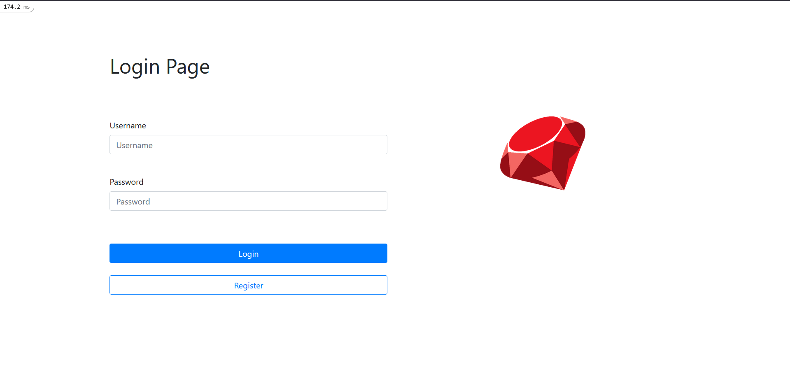
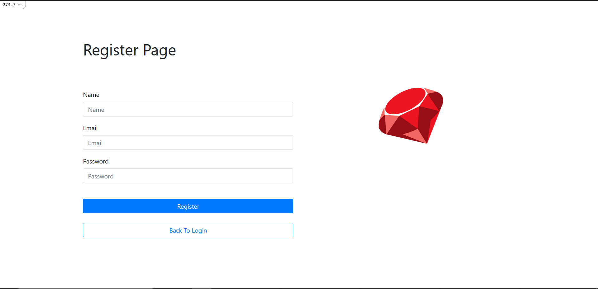
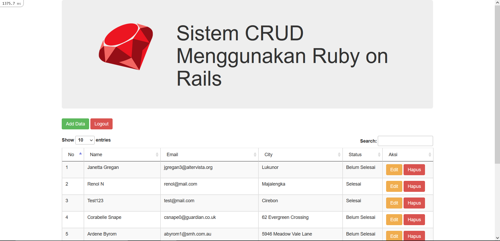
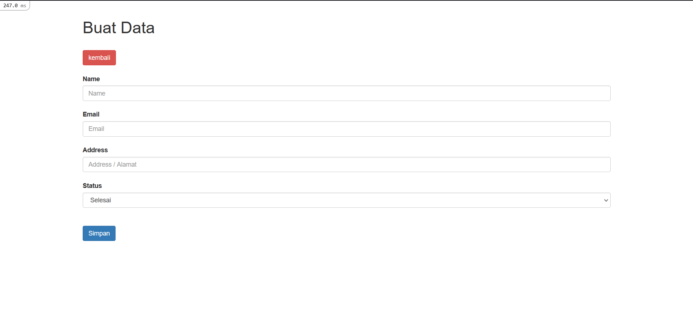
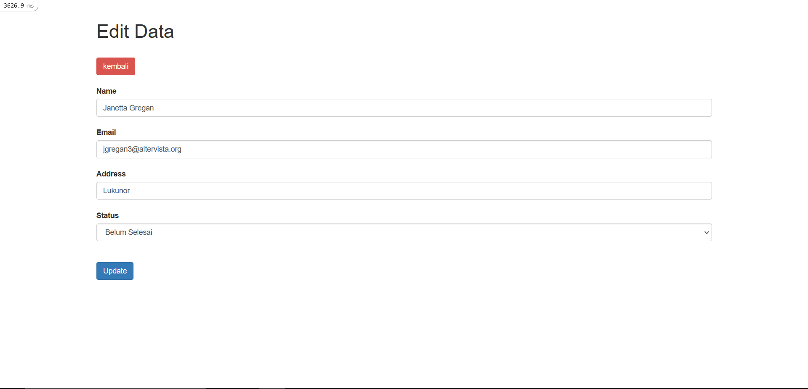
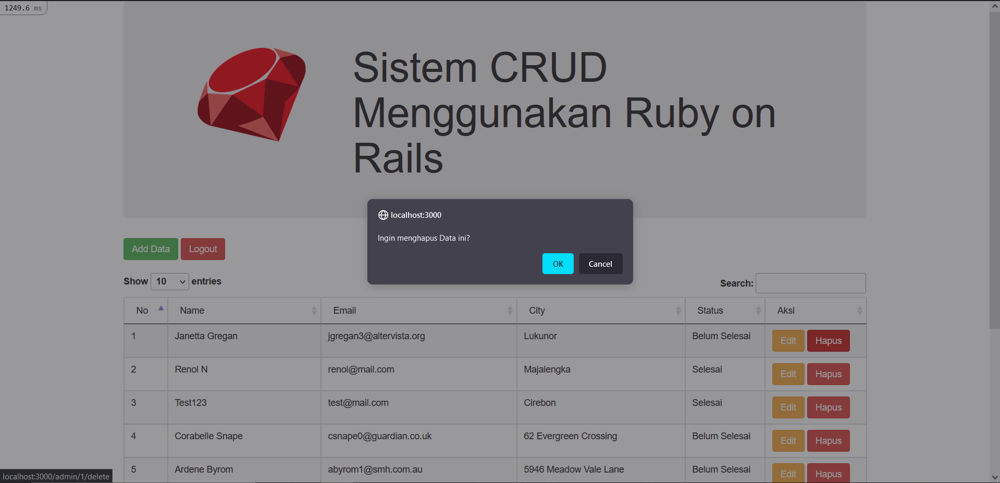
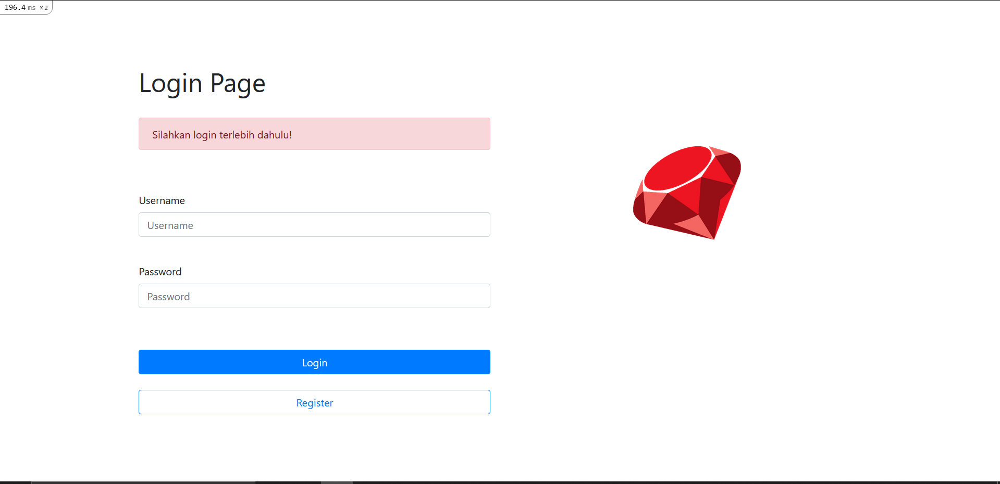

# README

This README would normally document whatever steps are necessary to get the
application up and running.

Things you may want to cover:

- Ruby version

  ruby 3.0.2p107 (2021-07-07 revision 0db68f0233) x86_64-linux

- System dependencies

- Configuration

- Database creation

- Database initialization

- How to run the test suite

- Services (job queues, cache servers, search engines, etc.)

- Deployment instructions

- ...

<h2>Login Page</h2>
 

 
<h2>Register Page</h2>
 

 
<h2>List Data Page</h2>
 

 
<h2>Add Data Page</h2>
 

 
<h2>Edit Data Page</h2>
 

 
<h2>Delete Data Page</h2>
 

 
<h2>Alert</h2>
 

 
